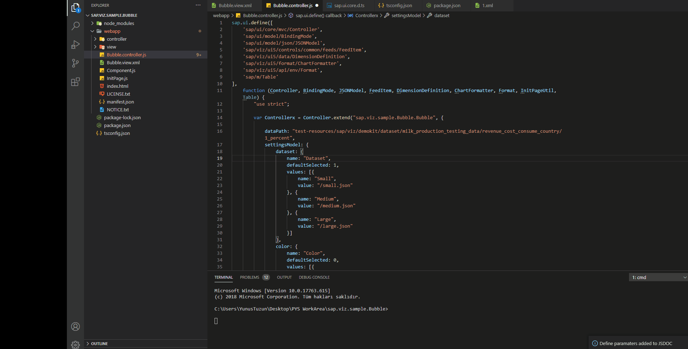
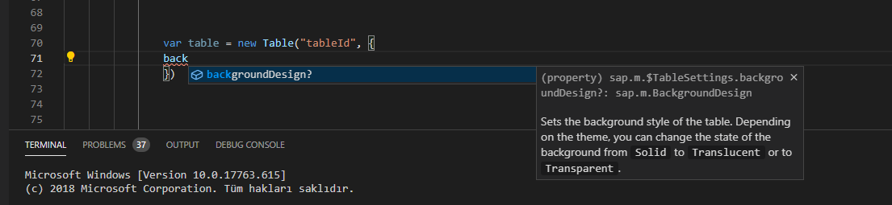

# UI5 JSDOC Sync


## Features
This VSCode Extension add JSDOC annotations into UI5 controller .

With  [@sapui5/ts-types](https://www.npmjs.com/package/@sapui5/ts-types) package it allow to autocomplete , syntax checking and increase productivity 






## Installation

```
npm install -g vsce
```


```
vsce package
```

```
Vscode -> Extensions - > Install From VSIX -> Select ui5-jsdoc-sync-0.0.1 file.
```

## Requirements
```
tsconfig.json 
{
    "compilerOptions": {
        "module": "none",
        "target": "es2018",
        "noEmit": true,
        "checkJs": true,
        "allowJs": true,
        "types": [
            "@sapui5/ts-types"
        ]
    }
}
```

```
npm i sapui5/ts-types
```

## Release Notes

### 0.0.1

**Enjoy!**
